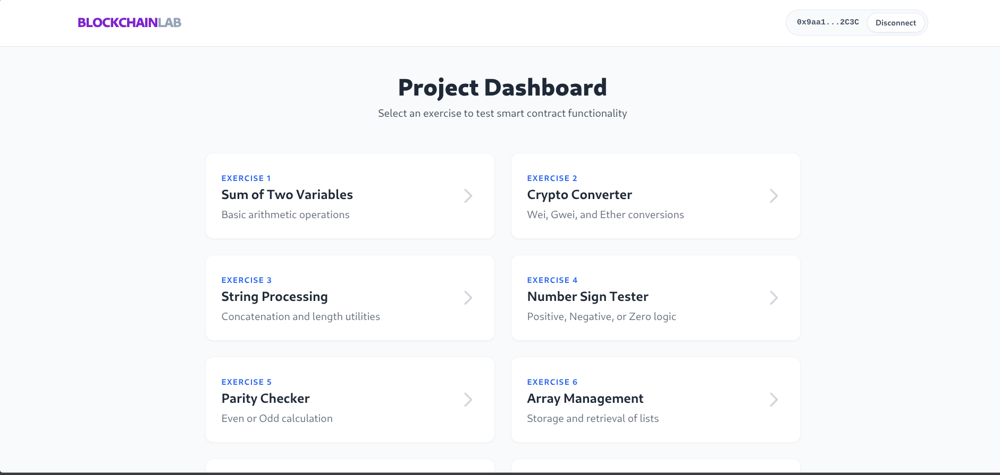
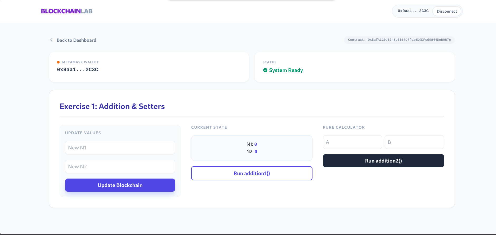
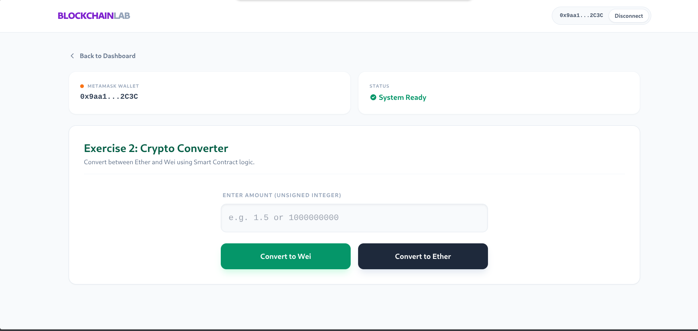
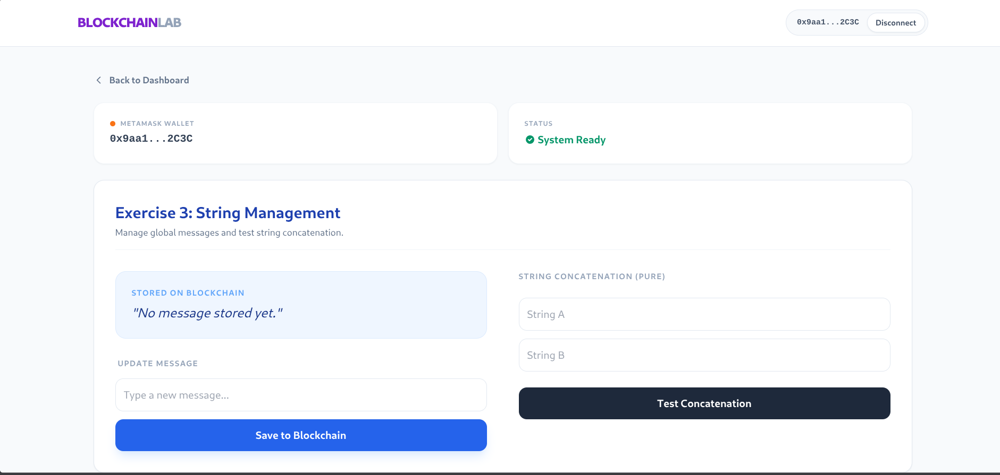
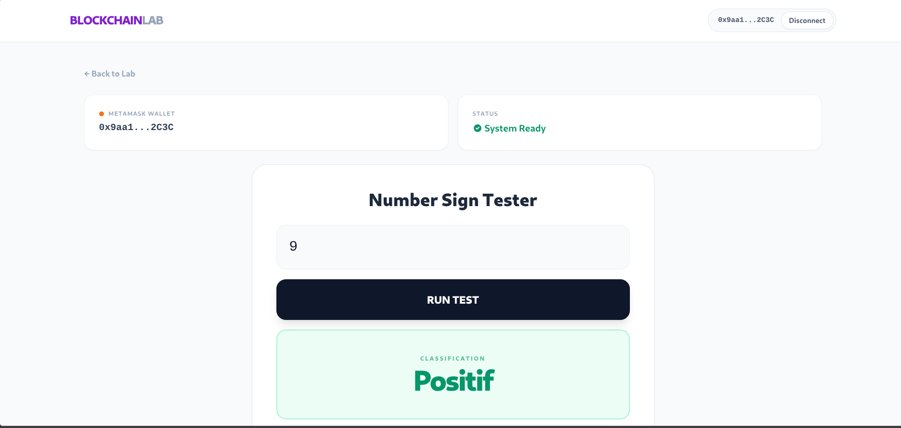
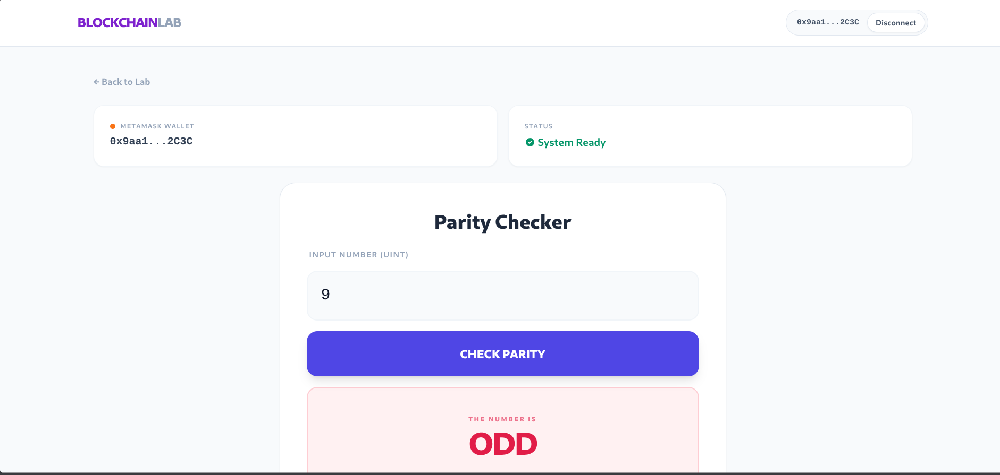
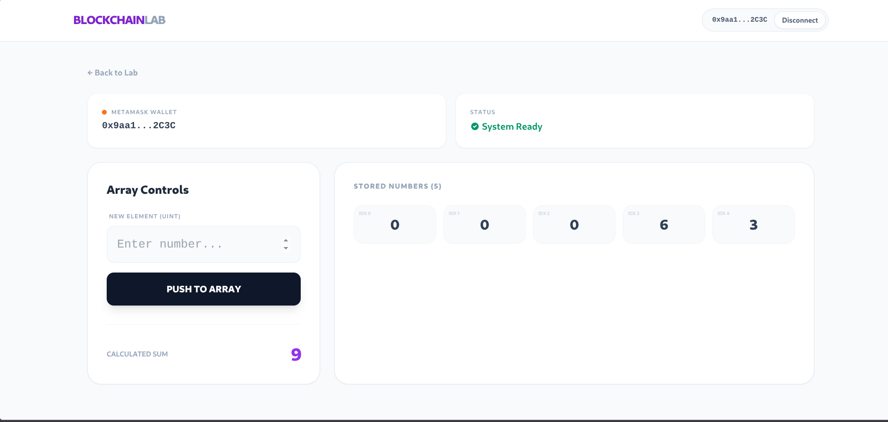
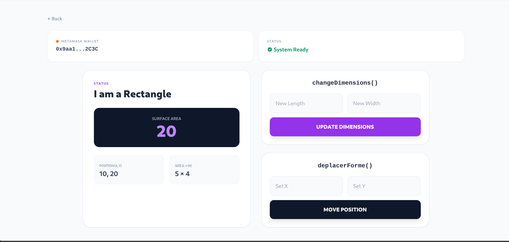
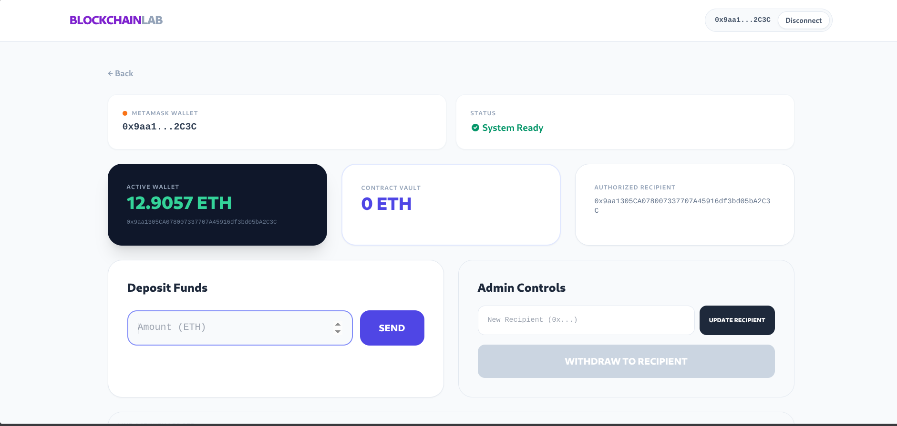

# Blockchain Lab: Decentralized Application (dApp)

This project is a small learning app for blockchain beginners. It lets you try simple smart contract examples in the browser and see how data is stored, updated, and read from the blockchain. Each exercise focuses on one basic idea, such as adding numbers, converting Ether and Wei, working with strings, checking if a number is even, managing arrays, using contract inheritance, or sending and withdrawing payments.

In simple terms, the app is a hands-on demo of how a blockchain app works from end to end: the smart contracts run on Ganache, Truffle deploys and tests them, and the React frontend lets you interact with them through MetaMask or the local network.



---

## Technical Stack

- Solidity `0.8.17` via Truffle
- React (Create React App) frontend in `client/`
- Web3.js for contract interaction
- Ganache running in containers (Podman/Docker Compose)
- MetaMask wallet integration

---

## Smart Contracts and Exercises

### Exercise 1: Addition

- Contract: `contracts/AdditionContract.sol`
- Core functions:
  - `setNumbers(uint _n1, uint _n2)`
  - `addition1()` (view)
  - `addition2(uint n1, uint n2)` (pure)

This exercise shows the difference between changing contract state and just reading or calculating values. `setNumbers()` updates stored values, `addition1()` reads them with `view`, and `addition2()` does a calculation with `pure`.



### Exercise 2: Crypto Converter

- Contract: `contracts/CryptoConverterContract.sol`
- Core functions:
  - `etherEnWei(uint montantEther)`
  - `weiEnEther(uint montantWei)`

This exercise shows simple math in Solidity. Both functions are `pure` because they only convert between units and do not read or change blockchain data.



### Exercise 3: String Management

- Contract: `contracts/GestionChainesContract.sol`
- Core functions:
  - `setMessage(string memory newMessage)`
  - `getMessage()`
  - `concatener(string memory a, string memory b)`
  - `concatenerAvec(string memory a)`
  - `longueur(string memory chaine)`
  - `comparer(string memory a, string memory b)`

This exercise shows how Solidity handles text, memory, and stored values. `setMessage()` changes contract storage, `getMessage()` reads it with `view`, and the other functions show string building, length checking, and comparison.



### Exercise 4: Positive / Negative / Zero

- Contract: `contracts/PositifNumberContract.sol`
- Core function:
  - `estPositif(int number)` returns `"positif"`, `"negatif"`, or `"nul"`

This exercise shows how to use signed integers and conditional logic. The function is `pure` because it only checks the number and returns a result without touching blockchain state.



### Exercise 5: Even Check

- Contract: `contracts/EvenContract.sol`
- Core function:
  - `isEven(uint number)` returns `bool`

This exercise shows a very small `pure` function that uses the modulo operator. It returns `true` for even numbers and `false` for odd numbers.



### Exercise 6: Array Management

- Contract: `contracts/ArraysContract.sol`
- Core functions:
  - `addNumber(uint _number)`
  - `getElement(uint index)`
  - `getArray()`
  - `sumArray()`

This exercise shows how to store and work with a dynamic array on the blockchain. `addNumber()` changes state, while `getElement()`, `getArray()`, and `sumArray()` are `view` functions that read the stored list.



### Exercise 7: Inheritance and Geometry

- Contracts:
  - `contracts/FormeContract.sol` (abstract base)
  - `contracts/RectangleContract.sol` (derived)
- Core functions:
  - `deplacerForme(uint dx, uint dy)`
  - `surface()` (override)
  - `changeDimensions(uint _newLo, uint _newLa)`
  - `afficheInfos()`
  - `afficheLoLa()`

This exercise shows inheritance and function overriding in Solidity. The base contract defines shared shape behavior, and the rectangle contract adds its own data and overrides `surface()` and `afficheInfos()`.



### Exercise 8: Payment Handling

- Contract: `contracts/PaymentContract.sol`
- Core functions:
  - `setRecipient(address _newRecipient)`
  - `receivePayment()` (payable)
  - `withdraw()` (recipient only)

This exercise shows a simple payment flow. `receivePayment()` is `payable` so the contract can accept Ether, and `withdraw()` lets only the chosen recipient take the funds back out.



---

## Frontend Pages

The React app routes are configured in `client/src/App.js`:

- `/exercice-1` Addition
- `/exercice-2` Crypto converter
- `/exercice-3` Strings
- `/exercice-4` Positive/negative/zero
- `/exercice-5` Even/odd
- `/exercice-6` Arrays
- `/exercice-7` Rectangle/Inheritance
- `/exercice-8` Payment

---

## Local Setup and Run

### 1) Start services

Use compose from the project root:

```bash
podman compose up -d --build
```

`ganache` is exposed on host port `7545` (container `8545`).

### 2) Install frontend dependencies

```bash
cd client
npm install
```

### 3) Compile and migrate contracts

Run from project root (inside your dev environment/container where `truffle` is available):

```bash
truffle compile
truffle migrate --reset --network development
```

### 4) Launch frontend

```bash
cd client
npm start
```

The app runs on `http://localhost:3000`.

---

## MetaMask Notes

- RPC URL: `http://127.0.0.1:7545`
- Chain ID: `1337`
- Currency symbol: `ETH`

Import one Ganache account private key from your running local chain.

---

## Repository Structure (Current)

```text
.
├── compose.yaml
├── Containerfile
├── truffle-config.js
├── contracts/
│   ├── AdditionContract.sol
│   ├── ArraysContract.sol
│   ├── CryptoConverterContract.sol
│   ├── EvenContract.sol
│   ├── FormeContract.sol
│   ├── GestionChainesContract.sol
│   ├── PaymentContract.sol
│   ├── PositifNumberContract.sol
│   └── RectangleContract.sol
├── migrations/
│   ├── 2_deploy_AdditionContract.js
│   ├── 3_deploy_CryptoConverter.js
│   ├── 4_deploy_GestionChaines.js
│   ├── 5_deploy_PositifNumber.js
│   ├── 6_deploy_OddEven.js
│   ├── 7_deploy_Arrays.js
│   ├── 8_depoloy_RectangleContract.js
│   └── 9_deploy_PaymentContract.js
├── test/
│   ├── addition-test.js
│   ├── array-test.js
│   ├── converter_test.js
│   ├── even_test.js
│   ├── payment_test.js
│   ├── positif_test.js
│   ├── rectangle_test.js
│   └── strings_test.js
├── screenshots/
└── client/
```

---

## Repository

- GitHub: https://github.com/wailrhazouani-tech/Blockchain_TP3
